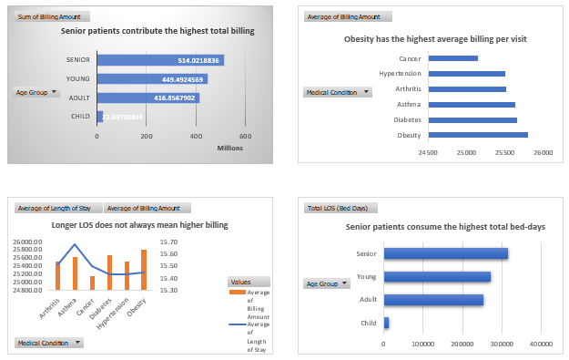
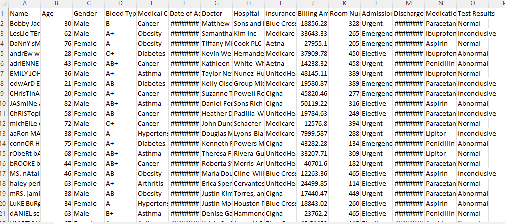
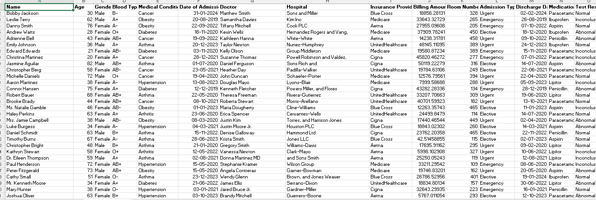
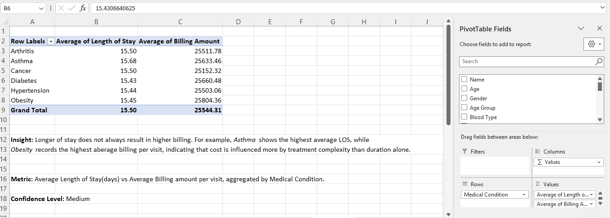

# Healthcare Data Analysis – Excel Project

## Candidate
Pritamjit Konar  
M.Sc Biotechnology

## Project Overview
This project demonstrates my practical use of Microsoft Excel for healthcare data analysis, focusing on data cleaning, structuring, analysis, and insight generation.

The objective of this project is to show my readiness for entry-level Data Analyst / Healthcare Data Analyst roles by transforming raw healthcare data into meaningful summaries and decision-support views.

All data used is anonymized / practice data and created only for learning and portfolio purposes.

Full excel working file (Google drive): https://docs.google.com/spreadsheets/d/13BNtST9RLHnMXURCIHH6t-myZZtBaEmM/edit?usp=sharing&ouid=100785637892916320515&rtpof=true&sd=true

*Important note:*
This project was built and tested in Microsoft Excel. For the most accurate view of the work, please download the file and open it in Microsoft excel.

## Skills Demonstrated
- Data cleaning and formatting  
- Excel formulas and functions  
- Descriptive analysis  
- Logical structuring of datasets  
- Attention to data accuracy  
- Healthcare-focused analytical thinking  

## Project Snapshots

### Dashboard Overview

### Raw Dataset

### Cleaned Dataset

### Analysis Sheet Example

## 📌 Data Source & Disclaimer

*Dataset source:* Kaggle (public healthcare dataset)

This project uses a publicly available dataset downloaded from Kaggle and is used strictly for *learning, practice, and portfolio demonstration purposes*.

All records are *anonymized and/or simulated*, and no real patient-identifiable information is included.

This project is *not affiliated with any hospital, healthcare provider, or organization.*  
It does *not represent real clinical outcomes* and should not be used for medical or business decision-making.

